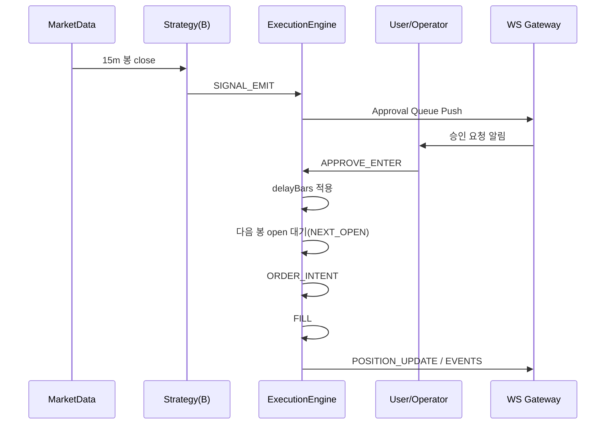
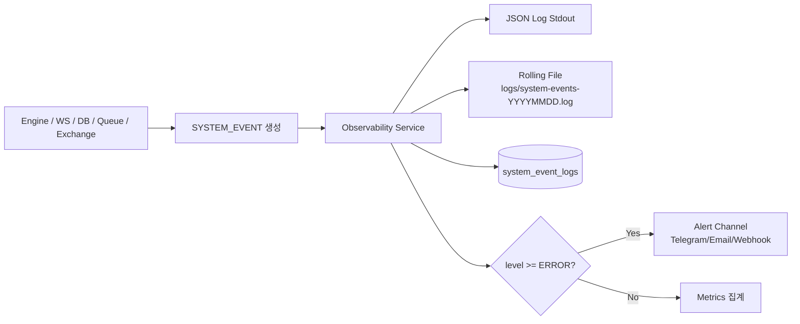
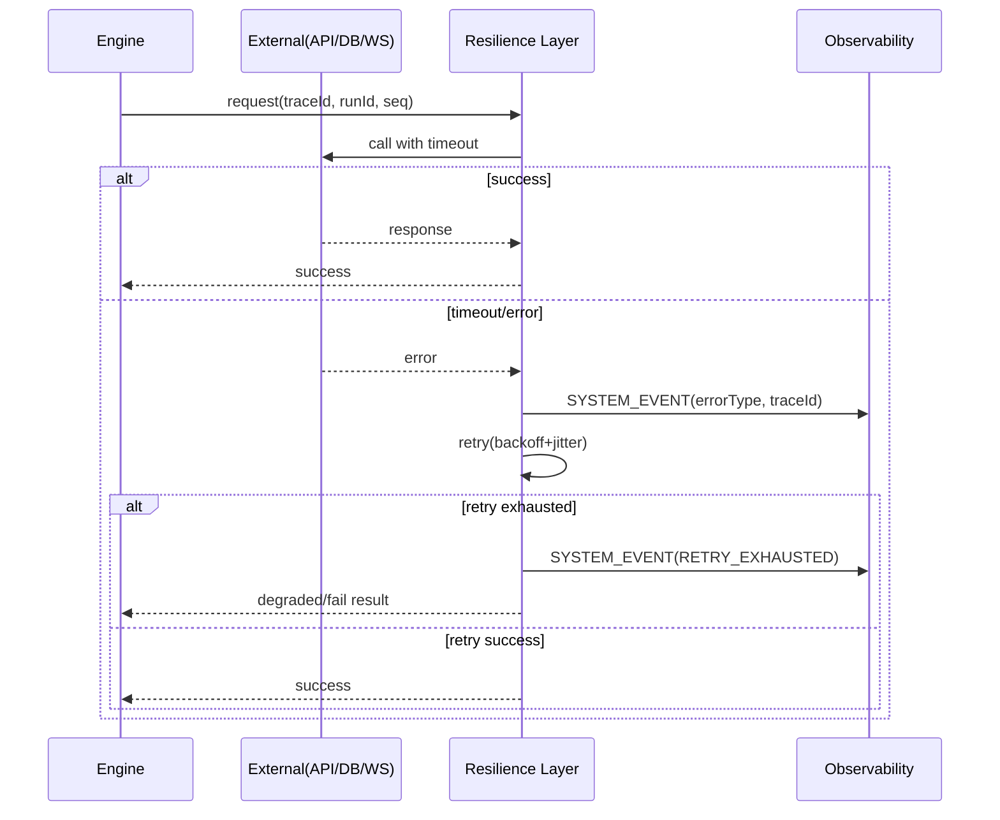

# 06_ARCHITECTURE.md
# 프로젝트 아키텍처 + 엔진 계약(Engine Contract) v1.1

## A. 아키텍처 개요
### A1) 핵심 원칙
- 3개 전략은 하나의 시장 데이터 피드를 공유하되, 전략별 `runId`, `strategyState`, `riskState`는 분리한다.
- 전략마다 달라지는 것은 “시그널/파라미터/포지션 정책” 뿐이다.
- 문서 통합/리팩터링 과정에서 로직 훼손을 막기 위해 **엔진 계약(Contract)** 을 단일 진실로 둔다.

참조:
- 전략 정의: `../specs/08_STRATEGIES.md`
- 파라미터(SSOT): `../specs/09_PARAMETER_REGISTRY.md`
- 실험/회귀: `../specs/10_EXPERIMENT_PROTOCOL.md`
- 프로젝트 구조/실시간 WS 모듈 설계: `../specs/12_PROJECT_STRUCTURE.md`

---

## B. 엔진 계약(Engine Contract) — 훼손 방지 규격

### B1) 불변 원칙
1) 전략은 “의사결정(Decision)”만 한다. 체결(Fill)과 포지션/리스크/기록은 엔진 책임이다.  
2) **룩어헤드 금지**: 미래 봉의 close가 필요한 판단은 그 close 이후에만 확정될 수 있다.  
3) 체결 타이밍/승인 흐름/우선순위/수수료 모드 변경은 전략 로직 변경급이다. (10에서 회귀 필수)

---

### B2) runConfig 계약(필수)
- runId
- strategyId / strategyVersion
- parameterSnapshot(JSON)
- market, timeframe(s), startAt, endAt
- mode(PAPER|SEMI_AUTO|AUTO|LIVE)
- fillModelRequested (AUTO|NEXT_OPEN|ON_CLOSE|NEXT_MINUTE_OPEN|INTRABAR_APPROX)
- entryPolicy (전략별 엔트리 타이밍 확정값)
- fee: common.fee.mode + (perSide OR roundtrip 단일)
- slippageAssumedPct
- riskSnapshot (09의 common.risk.* 기본값을 사용하되, run에서 스냅샷으로 반드시 기록)
- fillModelApplied (엔진이 최종 적용한 체결 모델; run_report/events에 기록)

---

### B3) 평가 시점(Evaluation Point) 계약
- `ON_CANDLE_CLOSE`에서만 확정 가능한 조건(양봉/음봉, close 기반)은 **close 이후에만 평가 가능**
- `ON_CANDLE_OPEN`에서는 해당 봉의 close를 알 수 없다.

---

### B4) fillModel 의미(정의 고정)
- fillModelRequested: 사용자가 요청한 체결 모델(또는 AUTO)
- fillModelApplied: 엔진이 최종 적용한 체결 모델(재현/분석 기준)
- AUTO: 전략/모드별 entryPolicy에 의해 엔진이 최종 fillModelApplied를 결정한다.
- NEXT_OPEN: 체결은 t+1 open
- ON_CLOSE: 체결은 t close
- NEXT_MINUTE_OPEN: 1m에서 신호 후 다음 1분 open
- INTRABAR_APPROX: 봉 내부 high/low로 SL/TP 동봉 근사(옵션)

---

### B5) “확증(confirm) + 체결” 룰(룩어헤드 방지)
confirm이 `close[t+1] > open[t+1]`처럼 “t+1 close 확정”을 요구한다면:
- confirm 판정 시점 = t+1 close 이후
- confirm 이후 진입 체결은 아래 중 하나만 허용:
  - t+1 close 진입(ON_CLOSE)
  - t+2 open 진입(NEXT_OPEN)
- confirm을 요구하면서 t+1 open 진입은 금지(룩어헤드)

---

### B6) SEMI_AUTO 승인 계약(STRAT_B)
- SEMI_AUTO는 승인 이벤트(`APPROVE_ENTER`)가 “신호 발생 이후”에 일어난다.
- 따라서 SEMI_AUTO에서 동일 봉 close(ON_CLOSE) 체결은 기본 재현 모델에서 금지.
- 계약:
  - AUTO: ON_CLOSE 허용
  - SEMI_AUTO: 승인 후 NEXT_OPEN(다음 봉 시가)만 허용
  - 승인 지연(몇 봉 뒤 승인인지)은 runConfig/run_report에 기록해야 한다.

---

### B7) 수수료 계약(Fee Contract) — 이중 적용 금지
- `common.fee.mode = PER_SIDE` → `common.fee.perSide`만 사용
- `common.fee.mode = ROUNDTRIP` → `common.fee.roundtrip`만 사용
- 둘 다 적용은 계약 위반(실험 무효)

---

### B8) TP/SL/TIME 충돌 우선순위(고정)
- STRAT_C: SL > TP1 > TP2 > TIME
- STRAT_B: 동봉 SL/TP 충돌 시 SL 우선
- 변경 금지

---

### B9) 이벤트/로그 계약(필수)
최소 이벤트:
- RUN_START / RUN_END
- CANDLE_OPEN / CANDLE_CLOSE
- SIGNAL_EMIT
- ENTRY_READINESS
- APPROVE_ENTER (SEMI_AUTO)
- ORDER_INTENT
- FILL
- POSITION_UPDATE
- EXIT(reason, pnl)
- RISK_BLOCK / PAUSE
- SYSTEM_EVENT (엔진/WS/DB/Queue/Exchange 계층 이슈)

필수 메타:
- strategyId/version, parameterSnapshot, fillModelRequested, fillModelApplied, entryPolicy, fee.mode, exit reason
- SYSTEM_EVENT는 추가로 `level`, `eventType`, `traceId`, `source`를 필수 포함한다.

---

## C. 핵심 기능 흐름 (Mermaid)

### C1) 실행 파이프라인(전략 공통)
```mermaid
flowchart TD
    A[RUN_START<br/>runConfig 로드] --> B[Market Data Ingest<br/>REST/WS]
    B --> C[Strategy Evaluate<br/>SIGNAL_EMIT]
    C --> D{Risk Check}
    D -- Block --> E[RISK_BLOCK / PAUSE]
    D -- Pass --> F[ORDER_INTENT 생성]
    F --> G[fillModelApplied 결정<br/>entryPolicy + mode]
    G --> H[FILL]
    H --> I[POSITION_UPDATE]
    I --> J{Exit Condition}
    J -- No --> B
    J -- Yes --> K[EXIT(reason,pnl)]
    K --> L[RUN_END]
```

### C2) STRAT_B SEMI_AUTO 승인 흐름


### C3) 시스템 이슈 로깅/알림 흐름


---

## D. 네트워크/외부연동 안정성 계약 (필수)

### D1) 경계 try/catch 규칙
- `exchange`, `db(supabase)`, `storage`, `queue`, `ws-gateway` 경계는 반드시 `try/catch`로 감싼다.
- catch에서 예외를 삼키지 않는다:
  - `SYSTEM_EVENT`(`level`, `eventType`, `traceId`, `source`)를 남긴다.
  - 호출자에 `Result<T, E>` 또는 도메인 예외로 명시 반환한다.

### D2) 타임아웃/재시도 규칙
- 모든 외부 I/O는 타임아웃을 강제한다(무제한 대기 금지).
- 재시도는 멱등 작업에만 허용:
  - 지수 백오프 + 지터 사용
  - 최대 재시도 횟수 초과 시 `ERROR` 로그 + 회로 차단기 상태 전환 검토
- 비멱등 작업(실주문, 중복 체결 위험)은 재시도 전에 idempotency key 또는 주문 조회 검증이 선행되어야 한다.

### D3) 순서/중복 방지 계약
- 이벤트는 `runId + seq + traceId`를 필수 포함한다.
- 저장 계층은 `(run_id, seq)` unique 위반을 정상 중복으로 처리하고 프로세스를 중단하지 않는다.
- out-of-order 이벤트는 즉시 실패 처리하지 않고:
  - 단기 버퍼링 후 재정렬 또는
  - `DEGRADED` 모드 전환 + 재동기화(snapshot + lastSeq) 수행

### D4) 장애 격리/강등(Degrade) 규칙
- WS 송신 실패는 엔진 핵심 루프와 격리한다(송신 실패로 run 중단 금지).
- DB 일시 장애 시:
  - 메모리/로컬 큐(내구 큐 권장)로 임시 적재
  - 복구 후 순차 flush
  - flush 실패 누적 시 `KILL_SWITCH_TRIGGERED` 또는 `RUN_PAUSE` 정책 발동

### D4.1 리스크/라이브 가드(현재 구현)
- 진입 직전(`ORDER_INTENT BUY`)에 아래 가드를 적용한다.
  - `RUN_MODE=LIVE` 이고 `ALLOW_LIVE_TRADING=false`면 `LIVE_GUARD_BLOCKED` + `PAUSE`
  - `RISK_DAILY_LOSS_LIMIT_PCT` 초과 손실이면 `RISK_BLOCK(reason=DAILY_LOSS_LIMIT)` + `PAUSE`
  - `RISK_MAX_CONSECUTIVE_LOSSES` 초과면 `RISK_BLOCK(reason=MAX_CONSECUTIVE_LOSSES)` + `PAUSE`
  - `RISK_MAX_DAILY_ORDERS` 초과면 `RISK_BLOCK(reason=MAX_DAILY_ORDERS)` + `PAUSE`

### D5) 필수 시스템 이벤트 타입
- `EXCHANGE_TIMEOUT`, `EXCHANGE_RETRY_EXHAUSTED`
- `SUPABASE_TIMEOUT`, `SUPABASE_WRITE_RETRY`, `SUPABASE_WRITE_FAILED`
- `WS_SEND_TIMEOUT`, `WS_SEND_DROPPED`
- `EVENT_OUT_OF_ORDER`, `EVENT_DUPLICATED`
- `CIRCUIT_OPENED`, `CIRCUIT_HALF_OPEN`, `CIRCUIT_CLOSED`

### D6) 네트워크 실패 처리 시퀀스


## E. Candle Time Integrity Notes
- `payload.candle.time` for 1m engine candles must be the minute bucket start in Unix seconds.
- Upbit REST snapshot candles must derive their bucket from `candle_date_time_utc`. The REST `timestamp` field is not the candle identity.
- Startup snapshot backfill must be cancellable. If startup timeout fires, the unfinished snapshot task must not mutate live `candleState` after WS live processing begins.
- Live WS processing must drop a closed candle if its candle time lags the triggering trade time by an abnormal amount. This guard exists to block corrupted historical state from triggering fills.

## F. Execution Sequence SSOT
- Canonical execution event order is defined in `apps/api/src/modules/execution/engine/execution-sequence.ts`.
- Strategy evaluation and realtime engine paths must reuse this module instead of rebuilding `ORDER_INTENT/FILL/POSITION_UPDATE` arrays independently.
- Entry sequence: `SIGNAL_EMIT -> ORDER_INTENT -> FILL -> POSITION_UPDATE`
- Exit sequence: `EXIT -> ORDER_INTENT -> FILL -> POSITION_UPDATE`
- STRAT_B semi-auto approval sequence: `SIGNAL_EMIT -> APPROVE_ENTER`, then approved execution `ORDER_INTENT -> FILL -> POSITION_UPDATE`

## G. Realtime Engine Module Boundary
- `apps/api/src/modules/execution/engine/upbit-realtime-engine.ts` is the realtime orchestrator. It owns websocket lifecycle, startup snapshot bootstrap, and event fan-out.
- `apps/api/src/modules/execution/engine/realtime-candle-state.ts` is the SSOT for minute candle state transitions:
  - live trade -> current minute candle
  - bucket rollover -> closed candle
  - snapshot candle -> minute bucket identity
- `apps/api/src/modules/execution/engine/strategy-runtime-processor.ts` is the SSOT for closed-candle strategy runtime transitions:
  - candle open/close evaluation
  - trade/ticker/orderbook runtime fan-in
  - semi-auto approval wait/execute path
  - risk block and pause emission
  - readiness event emission
- `apps/api/src/modules/execution/engine/strategy-runtime-state.ts` owns per-strategy runtime boot state such as `runId`, momentum state, risk state, and pending semi-auto entry.
- `apps/api/src/modules/execution/engine/strategies/<strategyId>/strategy.ts` is the only place where strategy-specific entry/exit logic may live.
- `apps/api/src/modules/execution/engine/shared/` owns reusable indicators, event types, timeframe aggregation, and strategy module contracts.
- Any future realtime change must preserve this direction:
  - websocket/data ingest -> candle state helper
  - closed candle -> runtime processor
  - emitted decisions/events -> gateway/persistence

## H. Runtime Mode State Machine SSOT
- `apps/api/src/modules/execution/engine/strategy-runtime-mode-machine.ts` is the SSOT for mode-specific runtime transitions.
- Runtime lifecycle states are:
  - `FLAT`
  - `WAITING_APPROVAL`
  - `IN_POSITION`
- Current mode rules:
  - `SEMI_AUTO`: entry signal requests approval and moves runtime to `WAITING_APPROVAL`
  - `SEMI_AUTO`: consumed approval triggers approved next-open entry and moves runtime to `IN_POSITION`
  - `PAPER`, `AUTO`, `LIVE`: executable entry intent follows the direct-entry path, then risk guards decide whether execution continues
- `apps/api/src/modules/execution/engine/strategy-runtime-state.ts` owns lifecycle sync between runtime data (`strategyState`, `pendingSemiAutoEntry`) and the explicit lifecycle state.

## I. Realtime Network Recovery SSOT
- `apps/api/src/modules/execution/engine/upbit-realtime-connection.ts` is the SSOT for Upbit websocket lifecycle and recovery behavior.
- This helper owns:
  - websocket construction
  - open/message/error/close listener binding
  - `trade/ticker/orderbook` subscription payload
  - reconnect backoff scheduling
  - health-check timer logging
  - reconnect recovery metric updates
- `apps/api/src/modules/execution/engine/upbit-realtime-engine.ts` must treat this helper as the only owner of websocket connection state and timers.
- Required recovery behavior:
  - open -> subscribe `trade`, `ticker`, `orderbook`
  - close without owner stop -> schedule reconnect
  - reconnect success -> mark recovery metric
  - owner stop/destroy -> clear timers and suppress reconnect scheduling

## J. Runtime Realtime Status SSOT
- `apps/api/src/modules/runs/runs.service.ts` is the SSOT for the runtime-facing `realtimeStatus` view attached to each run.
- `realtimeStatus.connectionState` must be derived in this priority order:
  1. transport state (`RECONNECTING`, `PAUSED`, `ERROR`)
  2. startup snapshot delay
  3. persistence backlog depth
  4. stale last-event age threshold
  5. `LIVE`
- `lastEventAt` is updated from accepted runtime events, not from UI polling.
- `staleThresholdMs` is emitted with the DTO so clients can explain why a run is delayed.

## K. Persistence Recovery SSOT
- `apps/api/src/modules/ws/gateways/run-event-persistence-buffer.ts` is the SSOT for DB write failure buffering and ordered flush recovery.
- Required behavior:
  - accepted runtime events are still ingested into in-memory runtime state immediately
  - subscriber publish happens only after DB persistence succeeds
  - DB failure enqueues the event per run and schedules exponential-backoff retry
  - queued events flush in original arrival order for that run
  - backlog depth and retry metadata feed `RunsService.setPersistenceBacklog`
- `apps/api/src/modules/ws/gateways/realtime.gateway.ts` must treat this helper as the only owner of persistence retry timers and buffered queue state.

## L. Snapshot Recovery Rule
- Startup snapshot loading may finish normally, fail, or time out.
- If snapshot loading times out, runtime runs stay in delayed status until the first valid live trade is processed.
- The first valid live trade clears the snapshot delay flag for all runtime strategies and live processing becomes the source of truth.

## M. Fill Ledger Persistence SSOT
- `public.text_run_events` remains the raw event log for debugging, replay, and run-level event history.
- `public.text_fills` is the persisted source of truth for strategy fill history and strategy account summary.
- `apps/api/src/infra/db/supabase/client/supabase.client.ts` must persist a valid `FILL` into both stores in one retryable operation:
  1. `text_run_events`
  2. `text_fills`
- Duplicate `(run_id, seq)` on `text_run_events` must not prevent a retry from inserting the missing `text_fills` row.
- `apps/api/src/modules/runs/runs.service.ts` must read persisted fills from `text_fills`, then merge runtime-retained fills by `runId:seq`.
- Rollout order for existing environments:
  1. apply the `text_fills` schema
  2. backfill historical `FILL` rows from `text_run_events`
  3. deploy the app code that reads from `text_fills`
- `apps/api/src/modules/runs/runs.service.ts` must derive strategy holdings from merged fill history, then mark open positions to the latest retained strategy candle close when one is available.
- Account summary fields split into:
  - fill-driven: `positionQty`, `avgEntryPriceKrw`, `realizedPnlKrw`, `fillCount`
  - mark-to-market: `markPriceKrw`, `marketValueKrw`, `equityKrw`, `unrealizedPnlKrw`, `totalPnlKrw`, `totalPnlPct`
- fill-driven account summary values must use net execution values after applying the configured fee mode and slippage assumptions.
- `apps/api/src/modules/runs/runs.service.ts` is also the SSOT for run KPI/trade artifact derivation:
  - `trades` = completed round-trip trade count
  - KPI return series = fee/slippage-adjusted closed-trade net returns
  - `trades.csv` = actual matched `EXIT` + terminal `FILL` rows only

## N. Position Sizing SSOT
- `apps/api/src/common/trading-risk.ts` is the SSOT for runtime risk snapshot resolution and entry sizing defaults.
- `apps/api/src/modules/execution/engine/strategy-runtime-processor.ts` is responsible for converting strategy entry/exit intent into sized execution payloads.
- BUY sizing sequence:
  1. STRAT_C는 `c.order.fixedKrw`가 유효하면 고정 주문금액을 우선 사용
  2. 그 외 전략은 latest strategy equity를 account base KRW로 우선 사용
  3. account history가 없으면 `seedKrw`로 fallback
  4. risk-based path에서는 `targetNotional = accountBaseKrw * maxPositionRatio`
  5. qty = `floor(targetNotional / fillPrice, 8 decimals)`
- SELL sizing must reuse the open runtime position qty.
- Strategy readiness scoring and signal generation stay qty-agnostic; sizing happens only inside the execution path after risk checks pass.

### D7) Runtime session shell sync and deterministic operator E2E
- Fixed run IDs may restore stale persisted runtime shells from older sessions.
- Engine startup must re-sync the restored shell to the current env session for:
  - `strategyVersion`
  - `mode`
  - `market`
  - derived `entryPolicy`
  - derived fill policy
- The runtime updates in-memory state first and persists the shell re-sync best-effort.
- `E2E_FORCE_SEMI_AUTO_SIGNAL=true` is reserved for STRAT_B operator-session verification.
- The flag creates a deterministic `APPROVE_ENTER` path from the next `1m` candle open while preserving the standard approval contract.
- `ENTRY_READINESS` must be deduplicated per strategy run when the candle time and readiness payload are unchanged, especially while `WAITING_APPROVAL`.
