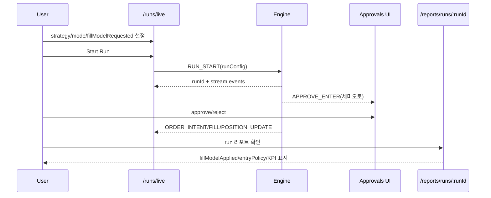
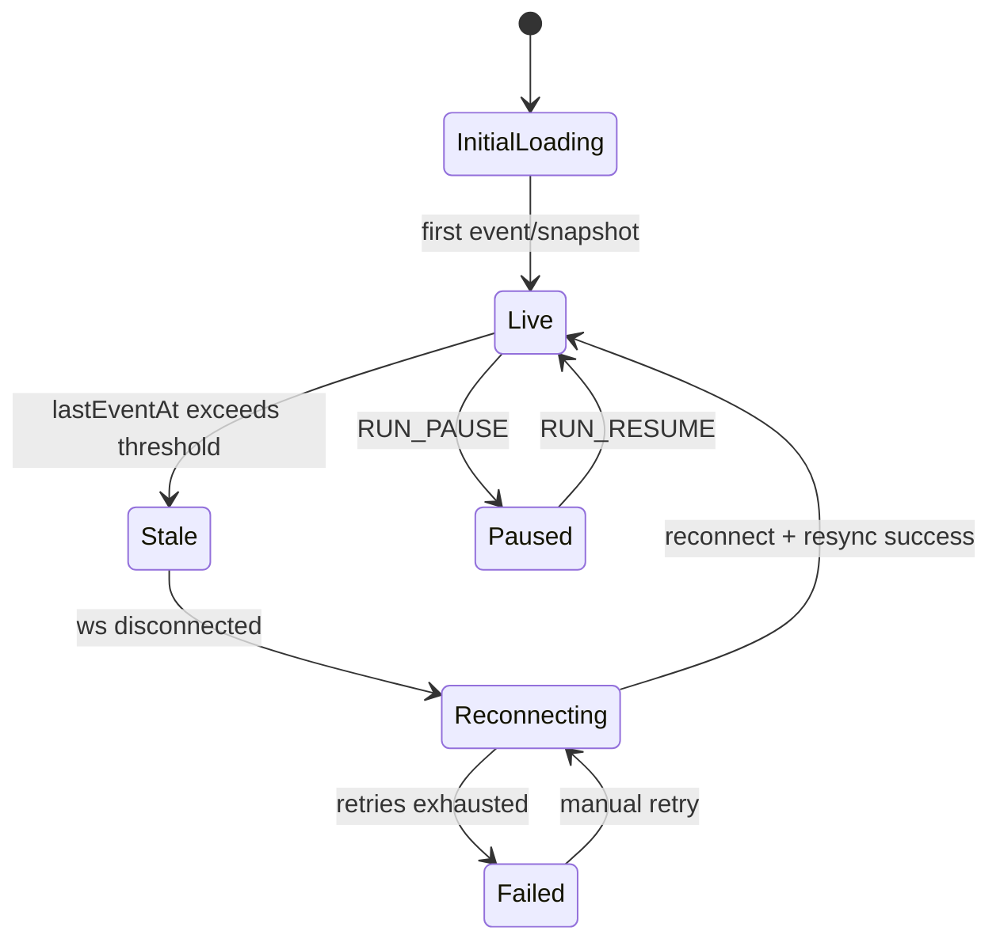

# 13_SCREEN_SPEC.md
# 화면 설계서 (Wireframe 수준 UI Spec) — 전략 실행/모니터링/실험/리포트/설정

## 0) 목적
- 전략 실행/모니터링/실험/리포트 업무를 “runId/strategyId 중심”으로 빠르게 수행한다.
- 실시간 테스트/실시간 적용에서 가장 위험한 “컨텍스트 누락(모드/체결모델)”을 UI로 강제 방지한다.

### 0.1 핵심 화면 흐름 (Mermaid)

참고:
- 전체 시스템 요약 흐름은 `15_ONE_PAGE_FLOW.md`를 따른다.
- 용어 표준은 `20_TERMS_GLOSSARY.md`를 따른다.

## 1) IA/라우트 기준
- IA/사이트맵/라우트의 단일 진실은 `11_IA.md`를 따른다.
- 본 문서는 IA를 재정의하지 않고, 각 라우트의 화면 구성/컴포넌트/상호작용 규칙만 정의한다.

## 2) 전역 UI 규칙(모든 페이지 공통)

### 2.1 상단 “컨텍스트 바” (필수, 릴리즈 게이트)
필수 노출 값 규칙은 `11_IA.md`를 따른다.
이 문서에서는 컴포넌트 구현 포인트만 추가 정의한다.

표시 컴포넌트: `RunContextBar`
- 좌측: 전략/런 식별
- 중앙: mode/fillModelRequested/fillModelApplied/entryPolicy
- 우측: 데이터기간/마켓 + “Copy context” 버튼(클립보드)

### 2.2 URL 상태 복원 규칙
필터/정렬의 URL 복원 규칙은 `11_IA.md`를 따른다.
- 예: `/reports/runs?strategyId=STRAT_A&from=2026-02-01&to=2026-03-01&sort=mdd`

### 2.3 공통 테이블 UX
- 기본: 검색(키워드), 기간(from~to), 정렬(sort), 페이지네이션
- 행 클릭 시 상세로 이동(단, 액션 버튼은 행 클릭과 분리)
- CSV 다운로드(필수): “현재 필터 상태 그대로” 내려받기

### 2.4 공통 경고/가드레일 UI
- LIVE 전환, killSwitch, 리스크 한도 변경은 항상 Confirm Modal + 2차 확인(checkbox) 적용

### 2.5 실시간 상태 배너(공통)
- 상단 우측에 `RealtimeStatusBadge`를 고정 노출한다.
- 표시 필드:
  - connectionState: `LIVE | DELAYED | RECONNECTING | ERROR | PAUSED`
  - lastEventAt
  - queueDepth(선택)
  - retryCount / nextRetryInMs(재연결 시)
- `ERROR` 또는 `DELAYED` 상태에서는 관련 액션 버튼에 보호 가이드를 노출한다.

### 2.6 데이터 상태 표준(공통)
- 모든 실시간 카드/테이블은 아래 5상태를 공통 적용:
  - `initial-loading`: 최초 데이터 수신 전
  - `live`: 정상 수신
  - `stale`: 지연 임계치 초과
  - `recovering`: 재동기화/재연결 중
  - `failed`: 복구 실패
- `empty`는 별도 상태로 유지한다(로딩과 혼동 금지).

---

## 3) 공통 컴포넌트(재사용 블록)

### 3.1 ChartPanel (전략 평가 핵심)
- 캔들 차트 + 오버레이
- 공통 오버레이:
  - 엔트리/청산 마커(원인 라벨 포함: SL/TP1/TP2/TIME/TRAIL/BULL_OFF/RISK_BLOCK)
  - 포지션 보유 구간(밴드)
- 전략별 오버레이:
  - STRAT_A: BB 밴드, ATR 트레일 라인
  - STRAT_B: POI Zone(FVG), BullMode ON/OFF 밴드
  - STRAT_C: breakout 기준선, value_spike/ buy_ratio 히트 마커

### 3.2 KPISummaryCard
필드(필수):
- Trades count
- Win rate
- Avg return
- Sum return
- MDD
- PF(Profit Factor, 있으면)
- Avg win / Avg loss
- Exposure(보유시간 평균)

### 3.3 TradeTable
컬럼(표준):
- tradeId
- entryTime, entryPrice, entryFillModel
- exitTime, exitPrice, exitReason
- grossReturnPct, netReturnPct
- qty / notional(KRW)
- signalTime
- approvalTime(세미오토만)
- barsDelay(signal→entry)
필터:
- exitReason (multi)
- win/loss
- minReturn / maxReturn
- date range

### 3.4 EventTimeline (엔진 로그)
- 이벤트 타입 필터: SIGNAL_EMIT, APPROVE_ENTER, ORDER_INTENT, FILL, EXIT, RISK_BLOCK, PAUSE
- 검색: reason 키워드
- 클릭 시 상세 패널: raw payload(JSON) + 링크(해당 tradeId)

### 3.5 ParameterSnapshot & Diff
- 현재 run의 파라미터 스냅샷(09 레지스트리 기준 렌더링)
- 이전 runId 선택 후 diff
  - 변경된 키만 강조(↑↓)
  - 영향도(HIGH/MED/LOW) 배지 표시

---

## 4) 라우트별 화면 설계

---

# 운영(Execution)

## 4.1 `/runs/live` — 실시간 실행 대시보드
### 목적
- 전략 선택 → 실행 설정(mode/fillModelRequested/entryPolicy) → run 시작(runId 생성)
- 실시간 모니터링(포지션/주문/체결/리스크/로그)

### 레이아웃
- 상단: `RunContextBar` (run 시작 전엔 runId = “(to be assigned)”)
- 좌측(메인): `ChartPanel`
- 우측(사이드): 실행 컨트롤 + KPI + 리스크 + 포지션/주문/체결 카드
- 하단 탭: Trades / Events / Parameters / Exit Reasons / Approvals

### 실시간 데이터 렌더링 규칙(필수)
- 이벤트 정렬 기준: `seq asc`(동일 seq 중복은 무시).
- 차트 데이터 소스:
  - 백엔드는 시작 시 업비트 REST `candles/minutes/1`로 스냅샷(최근 200개)을 선적재한다.
  - 이후 업비트 WS `trade` 스트림을 수신해 마지막 캔들을 델타 업데이트한다.
  - 프론트 `ChartPanel`은 `MARKET_TICK.payload.candle(1분 OHLC)`만 렌더링한다.
  - 연결 직후/재연결 직후에는 `GET /runs/:runId/candles?limit=300` 스냅샷을 선적용한 뒤 델타 이벤트를 병합한다.
- 화면 반영 우선순위:
  1. `SYSTEM_EVENT`, `RISK_BLOCK`, `KILL_SWITCH`
  2. `ORDER_INTENT`, `FILL`, `POSITION_UPDATE`
  3. `SIGNAL_EMIT`, 기타 로그
- 지연/끊김 처리:
  - `lastEventAt`가 임계치(기본 5초) 초과 시 전체를 `stale`로 표기
  - 재연결 성공 후 snapshot + delta 재동기화 완료 시 `live` 복귀
- 중복 클릭 방지:
  - Start/Pause/Resume/Stop/KillSwitch/Approve는 pending 동안 재클릭 불가
  - pending 3초 초과 시 버튼 우측에 "처리 지연" 표시

### 섹션/컴포넌트
1) **Execution Control Panel**
   - 필드
     - strategyId select (A/B/C)
     - market select (default KRW-XRP)
     - mode select (PAPER/SEMI_AUTO/AUTO/LIVE)
     - fillModelRequested (AUTO 또는 명시값)
     - entryPolicy (전략별)
       - A: afterConfirmFill (ON_CLOSE/NEXT_OPEN)
       - B: AUTO fillWhenAuto, SEMI fillWhenSemiAuto, approval.delayBars(실시간은 0~N)
     - fee.mode(PER_SIDE/ROUNDTRIP) + 값
     - slippageAssumedPct
     - riskSnapshot(현재 설정값 불러오기 + run override)
   - 버튼
     - Start Run
     - Pause / Resume
     - Stop
     - KillSwitch (즉시)
   - 상태 표시
     - engineState (IDLE/RUNNING/PAUSED/STOPPING/ERROR)
   - API 연동
     - 제어값 변경 시 `PATCH /runs/:runId/control`로 `strategyId/mode/market/fillModel/entryPolicy`를 즉시 동기화한다.
     - KPI 카드는 `GET /runs/:runId`의 `kpi`를 주기적으로 갱신한다.

2) **Position / Orders / Fills 카드**
   - Position 카드
     - side, avgEntry, qty, unrealizedPnL, holdingTime, stop/trail(있으면)
   - Orders 카드(활성 주문)
     - orderId, side, type, price, qty, status, createdAt, cancel
   - Fills 카드(최근 체결)
     - fillTime, price, qty, reason, slippage(추정)
     - data source must survive general event retention; do not rely on only the recent run event window

3) **Risk Monitor**
   - dailyLossLimit 사용량 바(현재 vs 한도)
   - maxConsecutiveLosses 카운터
   - maxDailyOrders 카운터
   - 최근 RISK_BLOCK 목록(시간/원인)
   - entry readiness must read the latest retained readiness snapshot, not only the latest 500 events

4) 하단 탭
   - Trades: `TradeTable`
   - Events: `EventTimeline`
   - Parameters: `ParameterSnapshot & Diff` (기본은 “현재 run snapshot만”)
   - Exit Reasons: 파이/바 차트 + 클릭 필터링(TradeTable 연동)
   - Approvals(SEMI_AUTO만): 승인 대기 큐
     - row: signalTime, suggestedPrice, poi info(B 전략), approve/reject
   - 현재 구현:
     - `SEMI_AUTO` 모드에서는 엔진이 `SIGNAL_EMIT -> APPROVE_ENTER`를 먼저 기록하고,
       다음 봉 시가(`NEXT_OPEN_AFTER_APPROVAL`)에 `ORDER_INTENT/FILL`을 생성한다.

### 상태 전이(런타임 UI)

### 컴포넌트별 상태 처리
- `ChartPanel`
  - stale 시 우상단 `Delayed` 배지 + 마지막 수신 시각 표시
  - recovering 중에는 최근 확정 캔들까지만 표시
- `TradeTable`
  - 신규 행은 2초 하이라이트 후 기본 상태로 복귀
  - 재동기화 중에는 테이블 상단에 "재동기화 중" 배너 표시
- `EventTimeline`
  - `SYSTEM_EVENT`는 고정 상단(핀) + 레벨별 색 분리
  - 중복 이벤트는 count 집계(`x3`)로 압축 가능

---

## 4.2 `/runs/history` — 실행 이력 목록
### 목적
- 과거 run 목록 탐색 → `/runs/:runId` 또는 `/reports/runs/:runId`로 이동

### 상단 필터 바(쿼리스트링 유지)
- strategyId
- mode
- date range(from/to)
- market
- sort: newest, winRate, sumReturn, mdd, tradesCount
- search: runId, tag, 메모

### 테이블 컬럼
- runId
- strategyId, version
- mode
- fillModelApplied
- entryPolicy 요약
- 기간(from~to)
- trades, winRate, sumReturn, mdd
- createdAt
- actions: Open(run), Report, Export

현재 구현 반영:
- `GET /runs/history`는 `strategyId`, `strategyVersion`, `mode`, `market`, `from`, `to` 쿼리 필터를 지원한다.
- 리포트 KPI에는 `PF(profitFactor)`, `avgWinPct`, `avgLossPct`를 포함한다.

---

## 4.3 `/runs/:runId` — 실행 상세(운영 관점)
### 목적
- “실행 중/실행 완료”의 원본 로그와 상태를 그대로 확인(운영/디버깅)

### 구성
- 상단: `RunContextBar` (필수)
- 좌: `ChartPanel` (run 구간만)
- 우: `KPISummaryCard` + `Risk Monitor` + “Artifacts”(trades.csv, events.jsonl) 다운로드
- 하단: Trades / Events / Orders/Fills / Parameters / Notes

### Notes(메모) 패널(권장)
- runId에 운영 메모/이슈 링크 남기기 (ex. “B 승인 지연 2봉 실험”)

---

# 전략(Strategies)

## 4.4 `/strategies` — 전략 목록/버전
### 목적
- A/B/C 전략 개요, 버전, 최근 성과 요약
- 각 전략 상세 및 파라미터 편집으로 이동

### 카드/테이블(둘 중 1)
- 전략 카드(권장)
  - strategyId, name, currentVersion
  - 최근 30일 KPI(승률/거래수/합산수익/MDD)
  - CTA: View / Edit Parameters / Start Run

### 필터
- strategyId
- 기간(성과 요약 기준)
- sort: winRate, sumReturn, mdd, trades

---

## 4.5 `/strategies/:strategyId` — 전략 상세
### 목적
- 전략 설명(정의/가설/실패조건/운영 모드) + 전략 전용 시각화

### 섹션
1) Strategy Overview
- name, version, timeframe, required data
- 핵심 가설/필터/진입/청산 요약
- “실전 운영 단계”: SEMI_AUTO→AUTO→LIVE 가드레일

2) Strategy Visualization(샘플 차트)
- 오버레이 소개(예: B의 POI zone)

3) Recent Runs Summary
- 최근 run 리스트(최대 10개)
- actions: compare(체크박스)

4) Links
- 파라미터 편집(`/strategies/:strategyId/parameters`)
- 실험 생성(`/experiments/new?strategyId=...`)

---

## 4.6 `/strategies/:strategyId/parameters` — 파라미터 편집
### 목적
- 09 레지스트리(SSOT) 기반으로 파라미터를 편집하고, 변경 이력을 남긴다.

### 구성
- 상단: strategyId + current paramSetId + “Publish as new paramSet” 버튼
- 좌: 파라미터 폼(그룹핑)
- 우: 영향도/설명/범위 + 변경 diff + “예상 영향 경고”

### 폼 필드(공통)
- key(읽기전용)
- value(edit)
- type 표시
- allowed range 표시
- impact badge(H/M/L)
- 설명(note)

### 기능
- “Reset to default”
- “Export JSON”
- “Publish”
  - publish 시: new parameterSetId 생성 + 변경 로그 자동 저장

---

# 실험(Experiments)

## 4.7 `/experiments/new` — 실험 생성(조건 고정)
### 목적
- 비교 가능한 조건을 고정한 뒤, 여러 runId(또는 전략) 비교 실험을 만든다.

### 필드(실험 조건)
- experimentName
- market
- 기간(from/to)
- dataset sources(15m/1m/trades 사용 여부)
- mode baseline (PAPER 권장)
- fee.mode + 값
- slippageAssumedPct
- 비교 대상 선택:
  - 전략 기준: STRAT_A/B/C
  - runId 기준: 선택된 runId들

### 버튼
- Create Experiment → `/experiments/:experimentId`

---

## 4.8 `/experiments` — 실험 목록
### 테이블 컬럼
- experimentId
- name
- market, 기간
- 비교 대상(전략/런 개수)
- createdAt
- actions: Open / Export

### 필터
- market, 기간, keyword

---

## 4.9 `/experiments/:experimentId` — 실험 상세/비교
### 목적
- “조건이 동일한 비교”인지 UI에서 강제 확인 + KPI 비교

### 섹션
1) Experiment Context Header
- market, 기간, fee/slippage, dataset source
- “조건 불일치 경고 배지”
  - fillModelApplied 다름
  - entryPolicy 다름
  - 기간 다름

2) Compare Table(핵심)
컬럼:
- strategyId / runId
- trades, winRate, avgReturn, sumReturn, mdd, PF
- entryPolicy, fillModelApplied
- actions: View report / View run

3) Charts
- Equity curve 비교(선택)
- Drawdown curve(선택)

4) Drill-down
- 특정 지표 클릭 시 해당 runId의 trades 필터된 뷰로 이동

---

# 리포트(Reports)

## 4.10 `/reports/runs` — run 리포트 목록
### 목적
- 운영(run)과 분석(report)을 분리한 목록(IA 원칙)

### 필터(쿼리스트링 유지)
- strategyId
- from/to
- mode
- fillModelApplied
- sort: winRate, sumReturn, mdd, trades

### 테이블 컬럼
- runId
- strategyId/version
- mode
- fillModelApplied
- entryPolicy 요약
- trades, winRate, sumReturn, mdd
- createdAt
- actions: Open report

---

## 4.11 `/reports/runs/:runId` — run 리포트 상세(검증/회귀)
### 목적
- KPI + `fillModelApplied`, `entryPolicy` 확인(회귀 검증)

### 구성
- 상단: `RunContextBar` (필수)
- KPI 영역: `KPISummaryCard` + 추가 지표(PF/MDD/Exit breakdown)
- 차트: `ChartPanel`(오버레이 필수)
- 분석 패널:
  - Exit Reason Breakdown(차트 + 표)
  - Time-of-day 성과(시간대별 승률/손익)
  - Slippage/Fill Quality(가능할 때)
- 하단 탭:
  - Trades(표준 TradeTable)
  - Parameters snapshot + Diff
  - Events timeline
  - Artifacts 다운로드(run_report.json, trades.csv, events.jsonl)

---

## 4.12 `/reports/compare` — 전략 비교 리포트
### 목적
- 기간/마켓 고정 후 전략별 성과를 한 화면에서 비교(“보고용”)

### 입력 필터
- market, from/to
- 전략 선택(A/B/C)
- mode (보통 PAPER)
- fee/slippage 고정
- (옵션) fillModelApplied 동일 조건만 보기 토글

### 출력
- 전략별 KPI 요약 카드(3열)
- Equity curve 비교
- Exit reason 비교
- Trades 분포(수익률 히스토그램)

---

# 설정(Settings)

## 4.13 `/settings/exchange` — 거래소 연결
### 섹션
- Upbit API Key 등록/상태(연결됨/만료)
- 권한 체크(조회/주문)
- 테스트: “시세 조회 테스트”, “주문은 금지(기본)”
- LIVE 전환 가드레일 안내(07 링크)

---

## 4.14 `/settings/risk` — 공통 리스크/수수료
### 목적
- 09의 common.risk/common.fee 기본값 관리(SSOT)

### 폼 필드(공통)
- common.risk.maxPositionRatio
- common.risk.dailyLossLimitPct
- common.risk.maxConsecutiveLosses
- common.risk.maxDailyOrders
- common.risk.killSwitch(default)
- common.fee.mode + 값(perSide/roundtrip)
- common.slippage.assumedPct

### 히스토리
- 변경 이력 테이블: changedAt, changedBy, diff, reason

---

## 4.15 `/settings/system` — 시스템/로그 정책
### 섹션
- 데이터 보관 정책(이벤트/트레이드/지표)
- 로그 레벨(운영/디버그)
- Export 설정(기본 경로, 파일명 규칙)
- 알림 설정(SEMI_AUTO: 텔레그램/이메일/앱 알림)

---

## 5) MVP 우선순위(개발 순서)
1) `/runs/live` (실행/모니터링 핵심)
2) `/runs/:runId` + `/reports/runs/:runId` (운영+검증)
3) `/strategies/:strategyId/parameters` (튜닝 루프)
4) `/experiments/:experimentId` (비교/학습)
5) settings(리스크/거래소)

## 6) 체크리스트(릴리즈 게이트)
- 실행/리포트 화면에 컨텍스트 바(strategyId/runId/mode/fillModelRequested/fillModelApplied)가 항상 노출되는가?
- 목록 필터/정렬이 URL로 복원되는가?
- SEMI_AUTO에서 승인 이벤트/진입 지연이 시각적으로 확인되는가?
- Exit Reason/우선순위 규칙이 UI로 확인 가능한가?

## 7) Realtime Status Badge Notes
- 라이브 화면은 섹션 제어 영역에서 backlog를 포함한 실시간 상태를 바로 보여줘야 한다.
- 현재 배지는 아래 필드를 표시한다.
  - `connectionState`
  - `lastEventAt`
  - 영속화 복구 중일 때 `queueDepth`
  - `retryCount`
  - 재연결 또는 영속화 재시도가 예약되어 있을 때 `nextRetryInMs`
- 제어 중인 전략은 다음 규칙을 따른다.
  - 로컬 소켓 재연결 상태와 pending action 상태는 즉시 반영한다.
  - backlog 깊이와 delayed 상태는 서버 `realtimeStatus`를 기준으로 유지한다.
- 제어 대상이 아닌 전략 섹션은 최근 서버 조회 시점의 `realtimeStatus` 스냅샷을 표시해도 된다.

## 8) Chart Time Zone Notes (ASCII appendix)
- `ChartPanel` must render time-axis labels and the crosshair time label in `Asia/Seoul` (`KST`).
- Candle payloads remain Unix-second bucket values in the API contract.
- Time zone conversion is display-only in the web chart layer.
- Intraday tick marks should stay compact, while the crosshair label should show full `YYYY-MM-DD HH:mm KST`.

## 9) Merged Live Layout Notes (ASCII appendix)
- `/runs/live` now renders a single merged strategy workspace instead of three repeated strategy sections.
- Top row layout:
  - left: chart for the currently selected strategy
  - right: strategy comparison table for `STRAT_A`, `STRAT_B`, `STRAT_C`
- The comparison table must include these columns:
  - strategy type
  - total PnL and total return
  - position quantity
  - average entry price
  - average return split by positive/negative
  - today's cumulative PnL amount
  - MDD
  - entry readiness
  - win rate and cumulative return
- Clicking a strategy row in the comparison table changes the chart/control/fills target strategy.
- The lower row keeps execution controls and fill history for the currently selected strategy.

## 10) Strategy Summary Realtime Metric Notes (ASCII appendix)
- The `/runs/live` strategy comparison table must treat account summary rows as mixed-source metrics.
- Fill-driven fields:
  - `positionQty`
  - `avgEntryPriceKrw`
  - `realizedPnlKrw`
  - `fillCount`
- Mark-to-market fields:
  - `markPriceKrw`
  - `marketValueKrw`
  - `equityKrw`
  - `unrealizedPnlKrw`
  - `totalPnlKrw`
  - `totalPnlPct`
- Mark-to-market fields should move on live candle/tick updates without requiring a manual refresh.
- Exit/KPI-driven fields such as `todayPnlAmount`, `winRate`, `sumReturnPct`, `avgWinPct`, `avgLossPct`, and `mddPct` should keep following exit/KPI events rather than every price tick.
